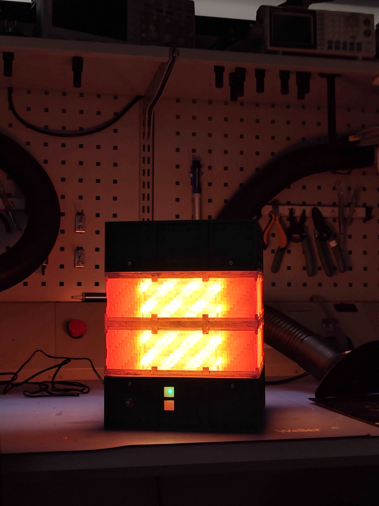

# EBF Lamp Project

You came after the Electrical Blast Furnace (EBF) from GregTech modpacks, especially GTNH. 
This repository contains all production files to date, plus special 3D-print files you can print at home and assemble yourself.

## HOW TO PRINT THE EBF

1. Download the whole repository.
2. In the '3D_prints' folder, find files for 3D printing.
3. The STLs come in two options: the **lamp version**, or for the r**egular version** (empty inside), which is simpler.
4. The lamp version requires a custom PCB, a step-down voltage module, and a power inlet. Because of these custom components, a full reproduction of the lamp from this repo is not possible in its current state.

## Plans for the future:

The repo won't have a complete support and maintained actively, because of the real life stuff.
* New PCB for electronics integration. It should integrate the power inlet and complete sensor and hardware integration.
* An optional buzzer for the EBF to make the "working" sounds.
* A humidifier on top, active while the EBF is "running".

## License
Hardware files are licensed under **CERN-OHL-P**; software is licensed under the **MIT License**. See the respective directories for full license text.
